architecture.md:
```# 🏗️ System Architecture Documentation

## Overview

This document provides detailed architectural diagrams and technical specifications for the Multi-Agent AI Research Assistant & Summarizer with MCP integration.

## 🎯 System Architecture Diagrams

### 1. High-Level System Architecture


### 2. Multi-Agent System Architecture

```mermaid
graph LR
    subgraph "Agent Ecosystem"
        direction TB
        RA[Report Agent<br/>📊 Research & Analysis]
        SA[Summary Agent<br/>📝 Content Summarization]
        NA[News Agent<br/>📰 News Aggregation]
        QA[Q&A Agent<br/>🤖 Question Answering]
        FA[Feedback Agent<br/>💬 Sentiment Analysis]
    end
    
    subgraph "LangGraph Components"
        direction TB
        REACT[React Agent Executor]
        MEMORY[Agent Memory]
        TOOLS_REG[Tools Registry]
        STATE_GRAPH[State Graph]
    end
    
    subgraph "MCP Tools Interface"
        direction TB
        ST[search_topic<br/>🔍 Web Search]
        SUM[summarize_topic<br/>📄 Text Summary]
        NT[get_news_topic<br/>📡 News Fetch]
    end
    
    subgraph "Prompt Engineering"
        direction TB
        RP[Research Prompts]
        SP[Summary Prompts]
        NP[News Prompts]
        QP[Q&A Prompts]
        FP[Feedback Prompts]
    end
    
    RA --> REACT
    SA --> REACT
    NA --> REACT
    QA --> MEMORY
    FA --> STATE_GRAPH
    
    REACT --> ST
    REACT --> SUM
    REACT --> NT
    
    RA --> RP
    SA --> SP
    NA --> NP
    QA --> QP
    FA --> FP
```



### 3. Data Flow Architecture


### 4. MCP Protocol Integration


### 5. Agent Interaction Patterns


## 🔧 Technical Implementation Details

### Agent Configuration

```python
# Report Agent Configuration
get_report_agent = create_react_agent(
    model=gemini_llm,
    tools=mcp_tools,
    prompt="""
    Research assistant with structured reporting capabilities.
    Uses search_topic tool for comprehensive information gathering.
    Outputs: Title, Introduction, Key Findings, Sources, Conclusion
    """
)

# Summary Agent Configuration  
get_summary_agent = create_react_agent(
    model=gemini_llm,
    tools=mcp_tools,
    prompt="""
    Summarization specialist for content condensation.
    Uses summarize_topic tool for key point extraction.
    Outputs: Title, Summary, Key Highlights, Conclusion
    """
)

# News Agent Configuration
get_news_agent = create_react_agent(
    model=gemini_llm,
    tools=mcp_tools,
    prompt="""
    News aggregation specialist for current events.
    Uses get_news_topic tool for latest information.
    Outputs: Headlines, Summary, Key Details, Sources
    """
)
```

### MCP Server Tools

```python
@mcp.tool()
async def search_topic(topic: str) -> str:
    """
    Comprehensive topic search with source attribution.
    Integrates multiple search engines via MCP protocol.
    """
    
@mcp.tool()
def summarize_topic(context: str) -> str:
    """
    Intelligent text summarization with key point extraction.
    Maintains context while reducing content length.
    """
    
@mcp.tool()
async def get_news_topic(topic: str) -> str:
    """
    Real-time news aggregation with fact verification.
    Sources from reliable news outlets with timestamps.
    """
```

### Asynchronous Processing

```python
async def generate_report_task(topic):
    # Parallel execution of report and news generation
    report_task = get_report_agent.ainvoke({"messages": [...]})
    news_task = get_news_agent.ainvoke({"messages": [...]})
    
    report_text, news_text = await asyncio.gather(
        report_task, news_task
    )
    
    # Merge and synthesize content
    merged_report = await merge_content(report_text, news_text)
    return merged_report
```

## 🔄 Integration Patterns

### 1. MCP Client Integration
- **Connection Management**: Persistent HTTP connections to MCP servers
- **Tool Discovery**: Dynamic tool registration and capability detection
- **Error Handling**: Graceful degradation when tools are unavailable

### 2. LangGraph Agent Orchestration
- **React Pattern**: Reasoning and acting cycles for complex tasks
- **Memory Management**: Context retention across agent interactions
- **Tool Selection**: Intelligent tool choice based on task requirements

### 3. Streamlit UI Integration
- **Session State**: Persistent data across user interactions
- **Async Handling**: Non-blocking UI updates during processing
- **Component Caching**: Performance optimization for repeated operations

## 📊 Performance Considerations

### Scalability Factors
- **Concurrent Requests**: AsyncIO enables multiple simultaneous operations
- **Memory Management**: Efficient session state handling
- **API Rate Limits**: Built-in throttling for external services

### Optimization Strategies
- **Caching**: Streamlit resource caching for MCP clients
- **Lazy Loading**: On-demand tool initialization
- **Batch Processing**: Grouped API calls where possible

## 🔒 Security Architecture

### API Key Management
- Environment variable isolation
- Secure credential storage
- API key rotation support

### Data Privacy
- Local report storage
- Session-based data isolation
- No persistent user data collection

### Input Validation
- Topic input sanitization
- MCP response validation
- Error boundary implementation

---

This architecture supports a robust, scalable, and maintainable multi-agent AI system with clear separation of concerns and efficient resource utilization.```