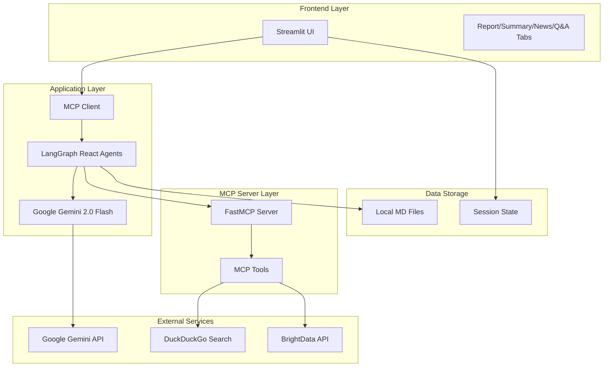
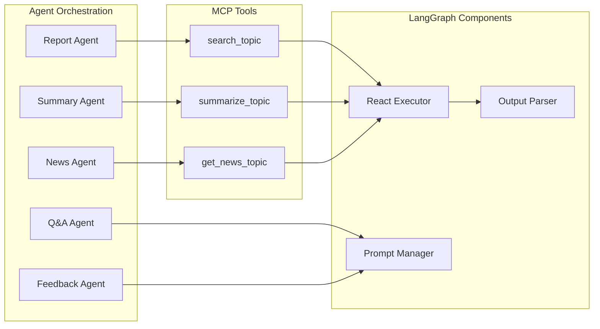
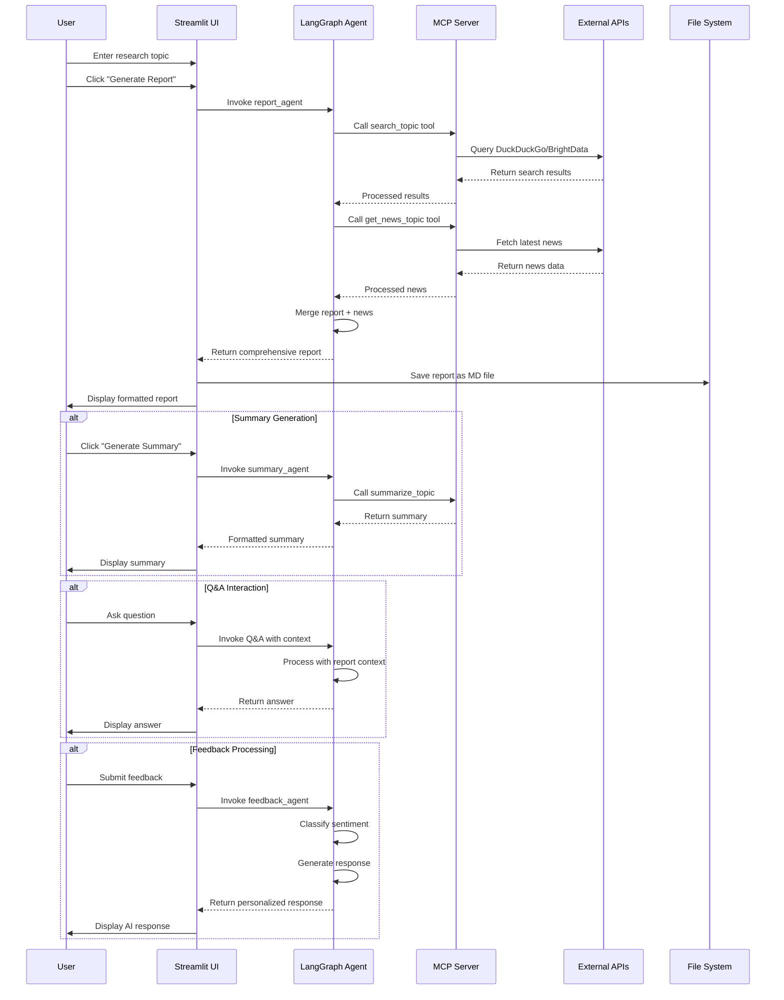

readme.md:
```
# 🤖 Multi-Agent AI Research Assistant & Summarizer With MCP

[](https://python.org)
[](https://streamlit.io)
[](https://langchain.com)
[](https://langgraph.com)
[](https://modelcontextprotocol.io)

A sophisticated multi-agent AI platform that leverages **LangGraph**, **Model Context Protocol (MCP)**, and **Google Gemini 2.0 Flash** to deliver comprehensive research, summarization, news aggregation, Q&A, and intelligent feedback processing capabilities.

## 🎯 Overview

This hackathon project combines cutting-edge AI technologies to create an intelligent research assistant that can:
- Generate detailed research reports with multiple data sources
- Provide concise summaries of complex topics
- Fetch and analyze latest news with fact-checking
- Answer questions based on research context
- Process user feedback with sentiment analysis

## 🏗️ System Architecture

### High-Level Architecture



### Multi-Agent System Flow



## 🔄 User Flow Diagram



## 🛠️ Technical Stack

| Component | Technology | Purpose |
|-----------|------------|---------|
| **Frontend** | Streamlit | Interactive web interface |
| **Backend** | Python + AsyncIO | Asynchronous processing |
| **AI Framework** | LangChain + LangGraph | Agent orchestration |
| **LLM** | Google Gemini 2.0 Flash | Language model |
| **Multi-Agent** | LangGraph React Agents | Specialized AI agents |
| **Protocol** | Model Context Protocol (MCP) | Tool integration |
| **Search** | DuckDuckGo MCP Server | Web search capabilities |
| **Data** | BrightData API | Enhanced web scraping |
| **Storage** | Local Markdown Files | Report persistence |

## 🚀 Features

### 🔍 Core Functionality
- **Intelligent Research Reports**: Generate comprehensive reports with title, introduction, key findings, sources, and conclusions
- **Smart Summarization**: Convert complex reports into digestible summaries with key highlights
- **Real-time News Aggregation**: Fetch latest reliable news with fact-checking and source verification
- **Context-Aware Q&A**: Ask questions based on generated research content
- **Sentiment-Based Feedback**: Automatic feedback classification with personalized AI responses

### 🤖 Advanced AI Features
- **Multi-Agent Orchestration**: Specialized agents for different tasks using LangGraph
- **Agentic Reasoning**: Dynamic tool usage and multi-step task execution
- **MCP Integration**: Seamless connection to external data sources
- **Asynchronous Processing**: Real-time interactions with concurrent operations
- **Memory Management**: Session-based context retention

### 🎨 User Experience
- **Tabbed Interface**: Organized sections for Reports, Summary, News, and Q&A
- **Color-Coded Sections**: Visual distinction between different content types
- **Auto-Save Reports**: Automatic markdown file generation with timestamps
- **Responsive Design**: Clean, modern interface with intuitive navigation

## 📁 Project Structure

```
multi-agent-ai-research-assistant/
├── research_client_ui.py      # Main Streamlit application
├── research_server.py         # FastMCP server with tools
├── get_mcp.py                # MCP client configuration
├── llm.py                    # Google Gemini LLM setup
├── feedback.py               # Sentiment analysis & response
├── requirements.txt          # Python dependencies
├── .env.example             # Environment variables template
├── reports/                 # Generated research reports
│   ├── report_2025-*.md    # Timestamped report files
└── screenshot_demo/         # Demo screenshots
```

## ⚙️ Installation & Setup

### Prerequisites
- Python 3.8+
- Node.js (for MCP servers)
- Google Gemini API key
- BrightData API token (optional)

### 1. Clone Repository
```bash
git clone <repository-url>
cd multi-agent-ai-research-assistant
```

### 2. Create Virtual Environment
```bash
python -m venv venv
source venv/bin/activate  # macOS/Linux
# or
venv\Scripts\activate     # Windows
```

### 3. Install Dependencies
```bash
pip install -r requirements.txt
```

### 4. Environment Configuration
Create `.env` file:
```env
api_key=YOUR_GOOGLE_GENAI_API_KEY
BRIGHT_DATA_API_TOKEN=YOUR_BRIGHTDATA_API_TOKEN
WEB_UNLOCKER_ZONE=unblocker
BROWSER_ZONE=scraping_browser
```

### 5. Start MCP Servers
```bash
# Terminal 1: DuckDuckGo MCP Server
npx duckduckgo-mcp-server

# Terminal 2: BrightData MCP Server (optional)
npx @brightdata/mcp
```

### 6. Launch Application
```bash
# Terminal 3: Main Application
streamlit run research_client_ui.py
```

## 🎮 Usage Guide

### Basic Workflow
1. **Enter Topic**: Input your research subject in the text field
2. **Generate Content**: Choose from Report, News, or Summary generation
3. **Interactive Q&A**: Ask questions about the generated content
4. **Provide Feedback**: Submit feedback to receive personalized AI responses

### Advanced Features
- **Report Merging**: Automatically combines research data with latest news
- **Context-Aware Answers**: Q&A agent uses report content as primary context
- **Sentiment Analysis**: Feedback system classifies and responds appropriately
- **Auto-Save**: All reports saved as timestamped markdown files

## 🔧 Configuration

### MCP Server Configuration
```python
config = {
    "mcpServers": {
        "duckduckgo-search": {
            "command": "npx",
            "args": ["-y", "duckduckgo-mcp-server"]
        },
        "bright_data": {
            "command": "npx",
            "args": ["@brightdata/mcp"],
            "env": {
                "API_TOKEN": "your_token",
                "WEB_UNLOCKER_ZONE": "unblocker",
                "BROWSER_ZONE": "scraping_browser"
            }
        }
    }
}
```

### Agent Prompts
Each agent has specialized prompts for optimal performance:
- **Report Agent**: Structured research with sources
- **Summary Agent**: Concise key points extraction
- **News Agent**: Latest reliable news aggregation
- **Q&A Agent**: Context-aware question answering

## 🚀 Deployment

### Local Development
```bash
streamlit run research_client_ui.py
```

### Production Deployment
1. Configure environment variables
2. Set up MCP servers as services
3. Deploy Streamlit app to cloud platform
4. Ensure API keys are securely managed

## 🔮 Future Enhancements

- [ ] **Additional MCP Servers**: Wikipedia, academic databases, social media
- [ ] **LangGraph Workflows**: Complex multi-step research pipelines
- [ ] **Visual Analytics**: Charts and graphs for report insights
- [ ] **Export Options**: PDF, DOCX, and presentation formats
- [ ] **Collaborative Features**: Multi-user research sessions
- [ ] **Advanced Memory**: Persistent conversation history
- [ ] **Custom Agents**: User-defined specialized research agents

## 🤝 Contributing

1. Fork the repository
2. Create feature branch (`git checkout -b feature/amazing-feature`)
3. Commit changes (`git commit -m 'Add amazing feature'`)
4. Push to branch (`git push origin feature/amazing-feature`)
5. Open Pull Request

## 📄 License

This project is licensed under the MIT License - see the [LICENSE](LICENSE) file for details.

## 🙏 Acknowledgments

- **LangChain Team** for the powerful AI framework
- **LangGraph** for multi-agent orchestration capabilities
- **Google** for Gemini 2.0 Flash API
- **Streamlit** for the intuitive web framework
- **MCP Community** for the Model Context Protocol

## 📞 Support

For questions, issues, or contributions:
- Create an issue on GitHub
- Join our community discussions
- Check the documentation

---

**Built with ❤️ for the AI community**
```